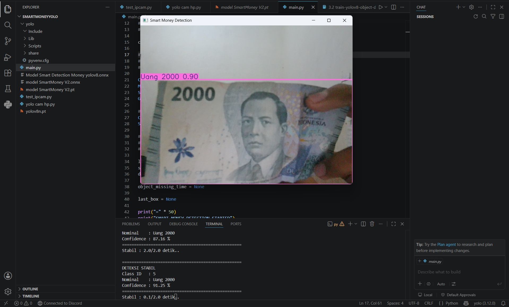
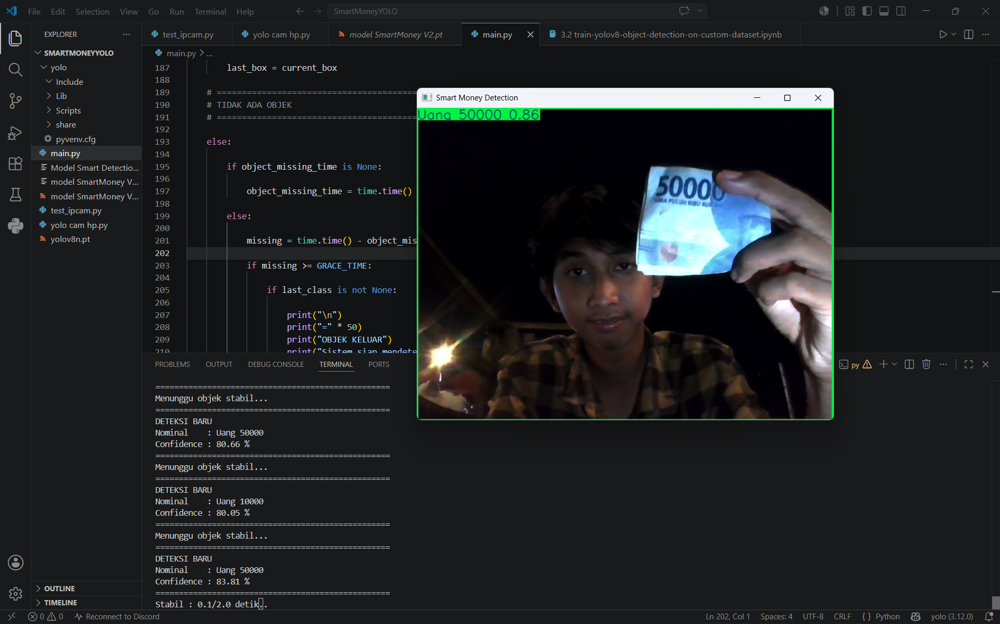

# 💵 Smart Money Detection using YOLOv8


---

## 📖 Deskripsi

Smart Money Detection merupakan proyek Computer Vision berbasis **YOLOv8** yang mampu mendeteksi nominal uang Rupiah secara **real-time** menggunakan Webcam maupun IP Camera.

Model dilatih menggunakan **Google Colab** dengan dataset yang dibuat menggunakan **Roboflow**, kemudian diekspor ke format **PyTorch (.pt)** dan **ONNX (.onnx)** agar dapat digunakan pada berbagai platform.

---

<h2>📷 Hasil Deteksi</h2>

<p align="center">
    
    
</p>

---

# ✨ Fitur

✅ Deteksi uang Rupiah secara real-time

✅ Menggunakan YOLOv8

✅ Support Webcam

✅ Support IP Camera

✅ Export ke ONNX

✅ Model hasil training sendiri

✅ Mudah dikembangkan

---

# 📂 Struktur Project

```
Yolo-DeteksiUang/
│
│
├── main.py
├── test_ipcam.py
├── yolo cam hp.py
│
├── model SmartMoney V2.pt
├── model SmartMoney V4.pt
├── model SmartMoney V2.onnx
├── Model Smart Detection Money yolov8.onnx
├── yolov8n.pt
│
├── requirements.txt
├── README.md
└── .gitignore
```

---

# 🛠 Persyaratan

- Windows 10 / 11
- Python 3.12
- Git
- Webcam (Opsional)
- Android + IP Webcam (Opsional)

---

# 📥 Clone Repository

```bash
git clone https://github.com/Keyion2478/Yolo-DeteksiUang.git

cd Yolo-DeteksiUang
```

---

# 🐍 Membuat Virtual Environment

```bash
python -m venv yolo
```

CMD

```cmd
yolo\Scripts\activate
```

PowerShell

```powershell
.\yolo\Scripts\Activate.ps1
```

Jika berhasil akan muncul

```
(yolo)
```

---

# 📦 Install Dependency

Upgrade pip

```bash
python -m pip install --upgrade pip
```

Install semua library

```bash
pip install -r requirements.txt
```

---

# 🔥 Install PyTorch

CPU

```bash
pip install torch torchvision torchaudio
```

GPU NVIDIA CUDA

```bash
pip install torch torchvision torchaudio --index-url https://download.pytorch.org/whl/cu124
```

Cek GPU

```bash
python -c "import torch; print(torch.cuda.is_available())"
```

Jika muncul

```
True
```

berarti GPU berhasil digunakan.

---

# ▶️ Menjalankan Program

Webcam

```bash
python main.py
```

IP Camera

```bash
python test_ipcam.py
```

atau

```bash
python "yolo cam hp.py"
```

---

# 🧠 Model

Repository menyediakan beberapa model.

| Model | Keterangan |
|---------|------------|
| model SmartMoney V2.pt | Model PyTorch |
| model SmartMoney V4.pt | Model PyTorch Terbaru |
| model SmartMoney V2.onnx | Model ONNX |
| Model Smart Detection Money yolov8.onnx | ONNX Deployment |
| yolov8n.pt | Pretrained Model |

---

# 🏋️ Training Model

Training dilakukan menggunakan **Google Colab**.

Notebook Training

https://colab.research.google.com/drive/1bqh8OFgAtigNNiPSCURG2_TWBrFeZsSP?usp=sharing

Notebook tersebut mencakup:

- Install Ultralytics
- Mount Google Drive
- Download Dataset dari Roboflow
- Training YOLOv8
- Validasi Model
- Export Model (.pt & .onnx)

---

# 📚 Dataset

Dataset dibuat menggunakan **Roboflow**.

Tahapan pembuatan dataset:

1. Mengumpulkan gambar uang Rupiah.
2. Melakukan anotasi objek di Roboflow.
3. Export dataset dalam format YOLOv8.
4. Menghubungkan dataset ke Google Colab.
5. Training model menggunakan notebook yang tersedia.

Dataset tidak disertakan pada repository ini karena ukuran file yang cukup besar.

---

# 📄 requirements.txt

Isi file requirements.txt

```text
ultralytics
torch
torchvision
torchaudio
opencv-python
numpy
pillow
matplotlib
pyyaml
```

Kemudian install

```bash
pip install -r requirements.txt
```

---

# 🚫 Folder yang Tidak Diupload

Folder berikut sengaja tidak dimasukkan ke GitHub.

```text
yolo/
venv/
runs/
__pycache__/
```

Folder tersebut akan dibuat otomatis setelah instalasi.

---

# 👨‍💻 Author

**Keyion2478**


